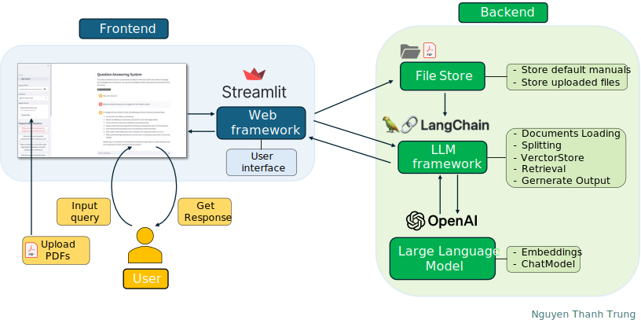
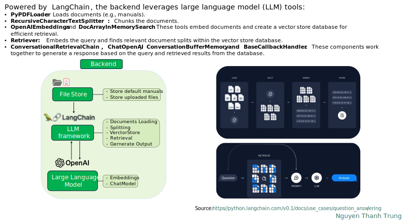
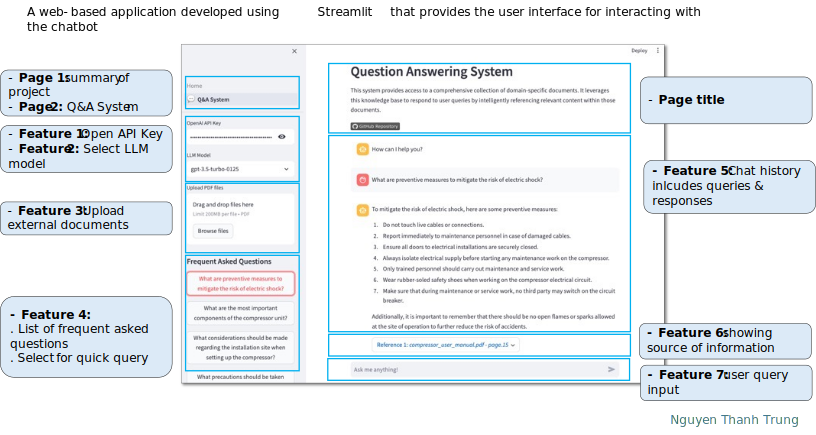
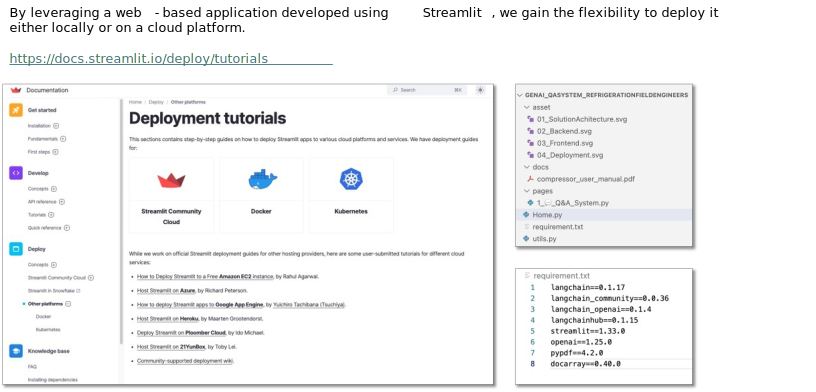

# LLM Project: Industrial Generative AI Q&A System for Refrigeration Field Engineers

[](https://github.com/Okeysir198/LLM-project)
[](https://www.linkedin.com/in/nttrung198/)
## Problem Statement

Design and implement a Q&A system to assist field engineers in the refrigeration domain. The system should facilitate the diagnosis of faulty equipment by utilizing installation and maintenance manuals.

## Solution Overview

This project implements a chatbot system utilizing LangChain and Streamlit. The system comprises the following key components:

* **Frontend:** A web-based application developed using Streamlit that provides the user interface for interacting with the chatbot.
* **Backend:** Powered by LangChain, the backend leverages large language model (LLM) tools for storing data, processing user input, and generating relevant responses.


## Detail
* **Solution Achitecture:**
  


* **Backend:**
  


* **Frontend:**
  


* **Deployment:** :  Please follow this link for deployment tutorials: [Streamlit Deployment Tutorials] (https://docs.streamlit.io/deploy/tutorials)
  
  

## ️ Running locally

```shell
# Install packages
pip install langchain==0.1.17 langchain_community==0.0.36 langchain_openai==0.1.4 langchainhub==0.1.15 streamlit==1.33.0 openai==1.25.0 pypdf==4.2.0 docarray==0.40.0

# Run the app
streamlit run Home.py
```


